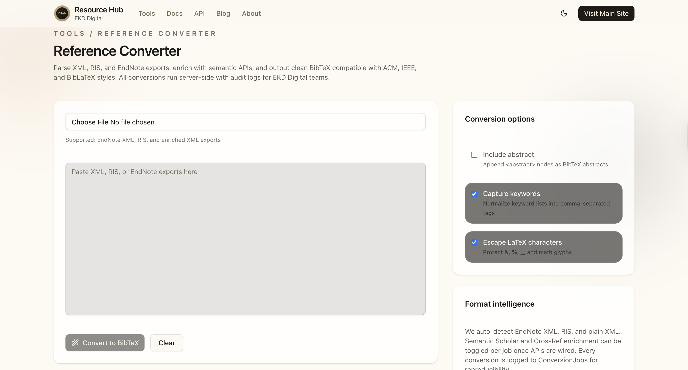

# EKD Digital Resource Hub (rHub)



> **Centralized tools for researchers** — starting with a fast, privacy-first Reference Converter.

## 🎯 Overview

EKD Digital Resource Hub (rHub) is a comprehensive platform designed to streamline research workflows. Our flagship tool converts EndNote XML, RIS, and enriched exports into validated BibTeX format in seconds, helping researchers build efficient workflows with properly formatted references ready for LaTeX, bibliographies, or research ingestion.

**Perfect for:**

- 📚 Researchers switching between citation formats
- 🎓 Academics submitting to journals requiring LaTeX
- 📝 Authors managing large bibliographies
- 🏥 Clinicians working with medical literature
- 📊 Publishers handling reference standardization

## 🎥 Tutorial Video

**Learn how to use the Reference Converter in 3 minutes:**

[](https://youtu.be/R-gNKL9s6WU)

**[▶️ Watch Tutorial: Convert EndNote XML to BibTeX](https://youtu.be/R-gNKL9s6WU)**

_This tutorial covers file upload, conversion process, and downloading your branded BibTeX files._

## ⚡ Reference Converter Features

### **Fast & Reliable**

- Convert EndNote XML, RIS, and enriched exports to BibTeX
- Process hundreds of references in seconds
- Intelligent format detection and validation

### **Privacy-First**

- All conversions processed locally on our servers
- No third-party data sharing
- Conversions logged for reproducibility only

### **Research-Ready Output**

- Clean, validated BibTeX format
- LaTeX-ready with proper character escaping
- Branded file naming: `ekddigital_rhub_{filename}.bib`

### **Smart Options**

- ✅ Include abstracts and keywords
- ✅ LaTeX character escaping
- ✅ Customizable citation styles
- ✅ Warning system for data issues

## 🚀 Quick Start

### Development

```bash
# Install dependencies
npm install

# Start development server
npm run dev

# Open http://localhost:3000
```

### Using the Reference Converter

1. **Visit**: [https://rhub.ekddigital.com/tools/ref](https://rhub.ekddigital.com/tools/ref)
2. **Upload**: Your EndNote XML or RIS file
3. **Configure**: Conversion options (abstracts, keywords, etc.)
4. **Convert**: Click "Convert to BibTeX"
5. **Download**: Get your branded `.bib` file

## 🛠 Tech Stack

- **Framework**: Next.js 16.0.3 with App Router
- **Language**: TypeScript
- **Database**: Prisma ORM with MySQL
- **Styling**: Tailwind CSS + Custom EKD Digital Design System
- **Deployment**: Vercel Platform

## 📚 Documentation

- **Live Site**: [https://rhub.ekddigital.com](https://rhub.ekddigital.com)
- **API Docs**: [https://rhub.ekddigital.com/docs](https://rhub.ekddigital.com/docs)
- **Reference Converter**: [https://rhub.ekddigital.com/tools/ref](https://rhub.ekddigital.com/tools/ref)

## 🎨 Brand Guidelines

rHub follows the EKD Digital design system:

- **Gold**: `#C8A061` - Accent color for highlights and CTAs
- **Navy**: `#182E5F` - Primary brand color
- **Maroon**: `#8E0E00` - Secondary accent for warnings/alerts

## 🤝 Contributing

1. Fork the repository
2. Create a feature branch: `git checkout -b feature/amazing-feature`
3. Commit changes: `git commit -m 'Add amazing feature'`
4. Push to branch: `git push origin feature/amazing-feature`
5. Open a Pull Request

## 📄 License

This project is proprietary software owned by EKD Digital.

## 🔗 Links

- **Website**: [EKD Digital](https://ekddigital.com)
- **Resource Hub**: [rHub Platform](https://rhub.ekddigital.com)
- **Tutorial**: [YouTube - Reference Converter Guide](https://youtu.be/R-gNKL9s6WU)
- **Support**: Contact via [EKD Digital](https://ekddigital.com)

---

_Built with ❤️ by [EKD Digital](https://ekddigital.com) — Empowering researchers with better tools._
